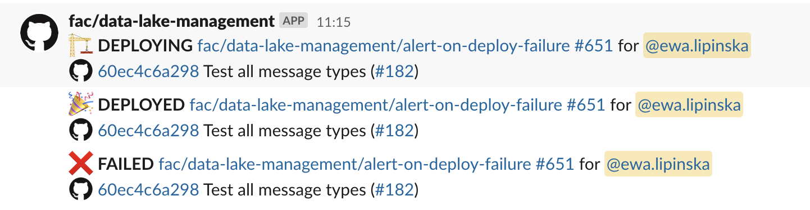

[](https://sonarcloud.io/summary/new_code?id=fac_serverless-tools)
[](https://sonarcloud.io/summary/new_code?id=fac_serverless-tools)
[](https://sonarcloud.io/summary/new_code?id=fac_serverless-tools)

# serverless-tools
A collection of tools used to ease the use of serverless projects.

The main goal of serverless tools is to provide a CLI to help deploy lambda functions. It can be used locally to update lambda functions in a developer account for quick iteration. Or, it can be used through a GitHub action for staging and production environments.

The standardisation of this tooling allows us to be confident in what we're deploying, takes the toil out of setting up serverless projects, and brings parity across the deployment tool chain.

## Requirements

* Ruby (see `.ruby-version`)
* Bundle (See Gemfile.lock)

See [FreeAgent Application Setup](https://www.notion.so/freeagent/Setting-up-the-FreeAgent-application-88b0179b53e949b793c25972cf8d4a29#1a5b89b08e05449bb402ad08d02de136) and follow the Setup Steps for bundle and ruby.

## Setup

`bundle install`

## Test

`bundle exec rake test`

## Installing

`bundle exec rake install`

## Examples

### Deployer

The deployer tool is used to bundle up the code in this repo and update the corresponding lambda functions.
It supports both lambdas with code in an S3 bucket as well as those deployed as a Docker container.

```yaml
  # Example entry in functions.yml for an S3-based function
  repo: serverless-tools
  s3_archive_name: function.zip
  handler_file: handler_one.rb
  bucket: freeagent-lambda-example-scripts

  # Example entry in functions.yml for an function in a Docker container
  repo: serverless-tools
  registry_id: "123456789"
  dockerfile: lambda-container-context/Dockerfile
```

> 🍎 If you have a development machine which differs to the Docker architecture required you can use the `platform` keyword
> to specific which platform the Image should be built for. For example, `platform: linux/amd64`

```zsh
  serverless-tools help # Run for all command options
```


The deployer takes 2 arguments:
  * action (which stage of the deploy process to run) - required
  * functions (which function from `functions.yml` to apply changes to) - optional, if not included will act on all the lambda functions.

The deployer uses the current git HEAD for which sha to push and update.

**Build**

Builds the Docker Image or builds a zip file containing the Lambda code and dependencies.
```zsh
  serverless-tools deploy build
```

**Push**
Pushes the build output (Zip or Image) to ECR or S3 (depending on its type).

Note, to push to ECR we must login via the Docker Login command. It is advised locally to setup the
[ECR credential helper](https://github.com/awslabs/amazon-ecr-credential-helper) to make it safer
to login to remote repositories.

```zsh
  serverless-tools deploy push
```

**Update**
Update the Lambda function with the latest asset version

```zsh
  serverless-tools deploy update
```

#### Github Actions

Example for a ruby project's Github workflow to build and push assets lambda code to S3.

```yaml
    name: Push Assets

on: [push]

jobs:
  push_assets:
    runs-on: ubuntu-latest
    env:
      BUNDLE_WITHOUT: development test
    steps:
      - name: checkout
        uses: actions/checkout@v2
      - uses: ruby/setup-ruby@v1
        with:
          bundler-cache: true
      - name: configure aws credentials
        uses: aws-actions/configure-aws-credentials@v1
        with:
          aws-access-key-id: ${{ secrets.AWS_ACCESS_KEY_ID }}
          aws-secret-access-key: ${{ secrets.AWS_SECRET_ACCESS_KEY }}
          aws-region: eu-west-1
          role-to-assume: arn:aws:iam::YOUR-AWS-ACCOUNT-NUMBER:role/YOUR-ROLE-HERE
          role-duration-seconds: 1200
      - name: build assets
        uses: fac/serverless-tools@v0.0.2
        with:
          command: deploy build
      - name: upload assets to pr
        uses: actions/upload-artifact@v2
        with:
          name: assets
          path: |
            *.zip
          if-no-files-found: error
      - name: push assets to s3
        uses: fac/serverless-tools@v0.0.2
        with:
          command: deploy push
```

### Comment

The comment tool is intended to be used as a Github Action. It takes a json hash (assumed to be the name of a lambda function and the status of the update)
and prints a formatted string with the Github Action expression to set an output. This output can then used to comment in a Github Issue.

```zsh
  serverless-tools comment -f '{"function_name": "Success"}'
```

### Notifier
The notifier tool can be used to post messages deployment status messages to Slack. It supports messages for start,
success, and failure of a deployment. The `notify` command takes the name of the status (`start`, `success`, `failure`) and Github workflow run id as arguments and `--repo` and Slack `--channel` name as required options.
The `GITHUB_TOKEN` and `SLACK_TOKEN` need to be set as environment variables to allow API querying.

Example Slack messages:



```zsh
  serverless-tools notify start 3546787456 --repo=fac/data-lake-management --channel=ABCDEFGH
```

Example usage in a Github Actions workflow:
```
  notify-start:
    runs-on: ubuntu-latest
    steps:
      - uses: fac/serverless-tools@v0.8.1
        env:
          GITHUB_TOKEN: ${{ secrets.GITHUB_TOKEN }}
          SLACK_TOKEN: ${{ secrets.SLACK_BOT_TOKEN }}
        with:
          command: notify start ${{ github.run_id }} --repo=${{github.repository}} --channel=ABCDEFGH
        continue-on-error: true
```

## Image

Serverless-Tools is bundled as a Docker Image to be used as a [Github Action](https://docs.github.com/en/actions/creating-actions/creating-a-docker-container-action).

### Building

To build the image locally, run:

```docker image build -t serverless-tools:latest .```

### Running

To execute the image locally run:

```docker container run serverless-tools:latest version```

You can run the image to mimic the way it would be ran by a Github Action. For example:

```aws-vault exec your-aws-profile -- docker container run -e AWS_DEFAULT_REGION -e AWS_ACCESS_KEY_ID -e AWS_SECRET_ACCESS_KEY -e AWS_SESSION_TOKEN -e GITHUB_ENV=/home/runner --workdir /github/workspace -v `pwd`:/github/workspace -v /var/run/docker.sock:/var/run/docker.sock serverless-tools:latest deploy build ```

Breaking down this command, we can see what it does:

`aws-vault exec your-aws-profile -- `. The first part uses aws-vault to assume an IAM role, and then this assumed role will be accessible when executing the next part of the command. To run any of the `deploy` commands, we need access to AWS. AWS Vault works by populating environments for the next part of the command.

`docker container run -e AWS_REGION -e AWS_ACCESS_KEY_ID -e AWS_SECRET_ACCESS_KEY -e AWS_SESSION_TOKEN`. We begin the call to `docker container run` and populate the environment variables of the container from the variables AWS Vault has populated.

`-e GITHUB_ENV=/home/runner` Set the GITHUB_ENV env var to a 'realistic value'. Ordinarily, This value changes on each run, but indicates that the CLI is running inside a Github Action and is used to format the output accordingly. For more infomation see [here.](https://docs.github.com/en/actions/learn-github-actions/environment-variables)

``--workdir /github/workspace``. We're now telling the run command that the working directory will be `github/workspace` - this can be any directory, we're just using the same namespace for parity with the Github Action. Essentially the command which is executed will be from within the working directory inside the container.


``-v `pwd`:/github/workspace`` We're then specifying a volume to be mounted, and we're mapping the current directory of the users machine to the working directory of the container. This accomplishes two things, firstly it provides the code that needs deploying to serverless-tools, and secondly it allows any assets which are generated to be local to the user and accessible to inspect.

`-v /var/run/docker.sock:/var/run/docker.sock` Next, we're binding the hosts docker sockets to the containers, this allows us to build Docker Images 'inside' the container. It is only required to build lambda functions which are Docker based.

`serverless-tools:latest deploy build` finally, we specify the image to run, and which commands to pass to it.

### Contributing

We welcome contributions to serverless-tools -- just add new code with appropriate tests in a branch, open a PR and mark it ready for review once it's ready for someone to look it over.

### Releasing
The repo is released as both a [Ruby gem](https://github.com/fac/serverless-tools/packages/1629067) and a [Docker container](https://github.com/fac/serverless-tools/pkgs/container/serverless-tools-gha) which can be used in Github Actions.

To release your PR's changes:
1. Run `bin/bump_version <NEW_VERSION>`
> [!TIP]
> This script supports `[major|minor|patch|pre|release]` or a given version number `[x.x.x]`

Once your PR is merged, the RubyGem and Container version will be pushed to the Github Container Registry

The Github Actions Workflow that published the gem will push a tag for the new version to the repo. To publish it:

> [!WARNING]
> Ensure the gem and docker image have been released on your merge. Otherwise creating the release notes
> will create a tag, causing the gem release to fail, and skip the docker image release.

1. Open [the gem's list of releases](https://github.com/fac/serverless-tools/releases).
1. Click on **Draft a new release**
1. In the **Choose a tag** dropdown, select the tag for the gem version you just released
   - If that version isn't listed, wait a minute or two and refresh the page
1. Click **Generate release notes**, review the notes
1. Publish it

### Testing Changes

There are various challenges to testing serverless tools as a GitHub Action locally. While running the image locally can provide some confidence, the nature of not controlling the GitHub Runner or how it mounts and runs the container can result in edge cases and errors.

One way to test changes prior to release is to create a pull request with your changes and update the `image` argument value in the `action.yml` file to "Dockerfile". Then, reference your branch where serverless tools are being used. For example:

```
- name: build assets
        uses: fac/serverless-tools@your-branch
        with:
          command: deploy build

```

Through this process, changes can be tested before merging. Be sure to update the `image` value in `action.yml` to the version you will release once testing is complete.
